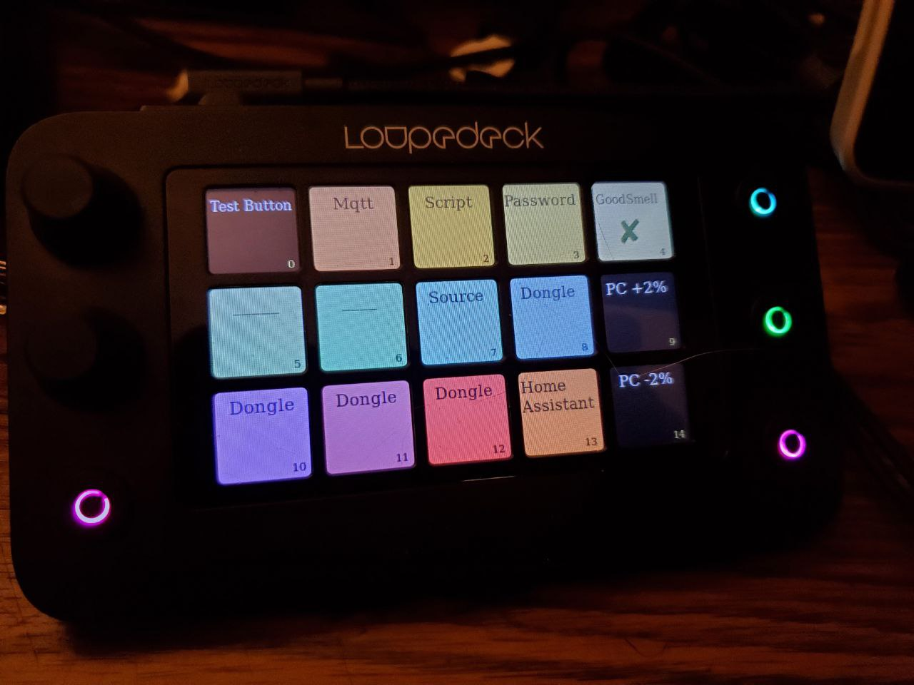

## Loupedeck multipurpose command runner setup for linux.

## Note: Active work in progress.  
### I made this for my personal use, so things are the way they are because of reasons

---
I primarily transfered over the logic I had written for my [Xcencelabs QuickKeys](https://github.com/instance-id/quick-keys-app) to the Loupedeck.

#### Features
* Script Running  
* Volume Adjustment
* MQTT message sending and receiving  
* Others I am not thinking of at the moment  

#### Note
It may be a bit diffifcult to figure out at first, but this includes an MQTT client in which I connect to my HomeAssistant instance and began adding two way communication to trigger sensor behavior, and subscribe/listen for events, then run local scripts based on message payload.

#### Dependencies
---
 Make sure you have the following installed in your system:

* node
* bash
* tmux
* npm

To install node dependencies run this from the project root folder

`$ npm install`

#### Configure

---

Edit the config/config.toml file to setup your Loupedeck

A .env file in your project root containing your MQTT settings (if applicable) or an empty file  

`$ touch .env`

Edit the .env file to set some settings

#### Start
---

If you use powershell run

`$ ./run.ps1`

If you use bash run

`$ ./run.sh`

This will spawn off an node instance handeling the Loupedeck in the background
you can check the logs with the tmux command

`$ tmux attach-session -t loupedeck`

---
See the below repo that the base library is capable of.  
Powered by Loupedeck Node library
Unofficial Node.js API for [Loupedeck Live](https://loupedeck.com/products/loupedeck-live/) & [Loupedeck Live S](https://loupedeck.com/products/loupedeck-live-s/) controllers.
